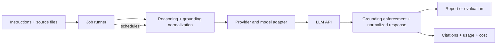

<p align="center">
  
</p>

<h1 align="center">FilePromptForge</h1>

<p align="center">
  <strong>One consistent interface for reasoning and mandatory web grounding across LLM providers.</strong>
</p>

<p align="center">
  Normalize single-shot LLM requests, then generate or evaluate large batches of reports unattended.
</p>

<p align="center">
  <a href="https://github.com/morganross/FilePromptForge/actions/workflows/ci.yml"></a>
  
  
  <a href="LICENSE"></a>
  
</p>

---

## What it does

FilePromptForge (FPF) is normalization middleware for the parts of LLM APIs
that are least consistent: reasoning and grounded web search. It gives an
application one set of controls while translating each request into the
payload expected by the chosen provider and model. It also normalizes the
useful parts of the response, including generated text, citations, usage, and
cost data.

That translation matters because a provider can use different parameters,
tool definitions, response fields, and capability rules from one model family
to the next. General-purpose LLM gateways smooth over ordinary text generation,
but reasoning and search still require model-aware handling. FPF concentrates
that knowledge in one place and makes grounding a requirement: a route must
invoke the appropriate search capability and return the expected evidence.
An ungrounded answer is a failed run, not an acceptable fallback.

FPF packages the normalization layer in a file-oriented processor. Each job
combines instructions and source material into a single LLM request; the job
runner can schedule many such jobs, recover from transient provider failures,
and produce reports or evaluations without supervision.

| Built for | What FPF provides |
|---|---|
| Request normalization | A stable set of inputs translated into provider- and model-specific payloads |
| Reasoning | Common controls mapped to native effort, budget, and thinking parameters |
| Mandatory grounding | Provider-native search is required and responses without the expected evidence are rejected |
| Response normalization | Consistent text, citation, usage, and metering output |
| Batch processing | Unattended generation or evaluation of large report collections |
| Provider resilience | Classified errors, bounded retries, timeouts, and resumable scheduling |
| Deep research | Background submission and polling for long-running research APIs |

## Pipeline



## Providers

The packaged configuration uses public API endpoints. Private,
OpenAI-compatible, or self-hosted gateways can be supplied through a separate
YAML configuration with `--config`.

| Provider route | API style | Primary use |
|---|---|---|
| OpenAI | Responses API | General grounded generation |
| Anthropic | Messages API | Claude generation with web search |
| Google | Gemini `generateContent` | Grounded Gemini generation |
| OpenRouter | Chat Completions | Broad model access with capability checks |
| Perplexity | Sonar | Search-native generation and research |
| Tavily | Research API | Asynchronous web research |
| OpenAI Deep Research | Responses API | Long-running OpenAI research |
| Google Deep Research | Interactions API | Long-running Gemini research |

Provider model catalogs change independently of FPF. When a provider retires
or changes a model, FPF surfaces the provider response rather than silently
substituting another model.

## Install

FPF requires Python 3.11 or newer.

```bash
git clone https://github.com/morganross/FilePromptForge.git
cd FilePromptForge
python -m pip install -e ".[dev]"
```

The PyPI package name is `filepromptforge`; the first public release is being
prepared as `0.1.0`.

## Quick start

Set the environment variable expected by your selected provider, then run:

```bash
fpf --file-a document.txt --file-b instructions.txt --out result.md \
  --provider openai --model gpt-5.6-sol
```

FPF reads the instruction file first and then the source document. A run can
generate a new report or use the instructions to evaluate the supplied
material. Run `fpf --help` for configuration paths, token limits, timeouts,
retries, JSON output, reasoning effort, and logging controls.

## Configuration and data locations

Configuration precedence is explicit CLI/function arguments, the selected YAML
file, then packaged public defaults.

Mutable files stay outside the installed package:

| Data | Default location |
|---|---|
| Credentials | Environment variables or the user configuration directory |
| Logs | Operating-system user log directory |
| Refreshed pricing | Operating-system user cache directory |
| Generated document | The path supplied with `--out` |

Explicit `--env`, `--log-file`, `FPF_LOG_DIR`, and `FPF_PRICING_PATH` settings
override those locations. Credentials are never included in the repository or
distribution.

## Test everything with one command

```bash
python scripts/test.py
```

This command creates a temporary isolated environment, builds the source and
wheel distributions, installs the wheel, starts the installed CLI, and runs
the complete repository test suite. It removes provider credentials from the
test environment and makes no live provider requests.

The same command runs in CI across Python 3.11–3.14 on Linux, Windows, and
macOS.

## Project status

FPF is a public beta. Its core behavior originated in a larger production
integration and is now packaged as a portable, public-facing normalization
layer and batch processor without removing its provider-specific reliability
machinery.

- [Installation](docs/installation.md)
- [Configuration](docs/configuration.md)
- [Providers](docs/providers.md)
- [Python API](docs/api.md)
- [Changelog](CHANGELOG.md)
- [Contributing](CONTRIBUTING.md)
- [Security policy](SECURITY.md)

## License

FilePromptForge is available under the [MIT License](LICENSE).
