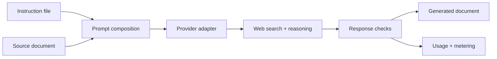

<p align="center">
  
</p>

<h1 align="center">FilePromptForge</h1>

<p align="center">
  <strong>Forge source files and instructions into grounded, reasoning-aware documents.</strong>
</p>

<p align="center">
  A provider-flexible Python CLI with retries, response checks, metering, and deep-research support.
</p>

<p align="center">
  <a href="https://github.com/morganross/FilePromptForge/actions/workflows/ci.yml"></a>
  
  
  <a href="LICENSE"></a>
  
</p>

---

## What it does

FilePromptForge (FPF) combines an instruction file with a source document,
routes the resulting prompt through a selected LLM provider, checks the
provider response for the guarantees required by that route, and writes a
document plus metering information.

| Built for | What FPF provides |
|---|---|
| Grounded generation | Provider-side web search and source evidence |
| Deliberate output | Provider-native reasoning controls |
| Long-running research | Background polling for deep-research routes |
| Operational resilience | Classified errors, bounded retries, and resumable scheduling |
| Cost visibility | Provider-specific usage extraction and pricing records |
| Multiple providers | One file-oriented interface across eight adapters |

## Pipeline



## Providers

The packaged configuration uses public API endpoints. Private,
OpenAI-compatible, or self-hosted gateways can be supplied through a separate
YAML configuration with `--config`.

| Provider route | API style | Primary use |
|---|---|---|
| OpenAI | Responses API | General grounded generation |
| Anthropic | Messages API | Claude generation with web search |
| Google | Gemini `generateContent` | Grounded Gemini generation |
| OpenRouter | Chat Completions | Broad model access with capability checks |
| Perplexity | Sonar | Search-native generation and research |
| Tavily | Research API | Asynchronous web research |
| OpenAI Deep Research | Responses API | Long-running OpenAI research |
| Google Deep Research | Interactions API | Long-running Gemini research |

Provider model catalogs change independently of FPF. When a provider retires
or changes a model, FPF surfaces the provider response rather than silently
substituting another model.

## Install

FPF requires Python 3.11 or newer.

```bash
git clone https://github.com/morganross/FilePromptForge.git
cd FilePromptForge
python -m pip install -e ".[dev]"
```

The PyPI package name is `filepromptforge`; the first public release is being
prepared as `0.1.0`.

## Quick start

Set the environment variable expected by your selected provider, then run:

```bash
fpf --file-a document.txt --file-b instructions.txt --out result.md \
  --provider openai --model gpt-5.6-sol
```

FPF reads the instruction file first and then the source document. Run
`fpf --help` for configuration paths, token limits, timeouts, retries, JSON
output, reasoning effort, and logging controls.

## Configuration and data locations

Configuration precedence is explicit CLI/function arguments, the selected YAML
file, then packaged public defaults.

Mutable files stay outside the installed package:

| Data | Default location |
|---|---|
| Credentials | Environment variables or the user configuration directory |
| Logs | Operating-system user log directory |
| Refreshed pricing | Operating-system user cache directory |
| Generated document | The path supplied with `--out` |

Explicit `--env`, `--log-file`, `FPF_LOG_DIR`, and `FPF_PRICING_PATH` settings
override those locations. Credentials are never included in the repository or
distribution.

## Test everything with one command

```bash
python scripts/test.py
```

This command creates a temporary isolated environment, builds the source and
wheel distributions, installs the wheel, starts the installed CLI, and runs
the complete repository test suite. It removes provider credentials from the
test environment and makes no live provider requests.

The same command runs in CI across Python 3.11–3.14 on Linux, Windows, and
macOS.

## Project status

FPF is a public beta. The core behavior originated in a larger production
integration and is being separated into a portable package without removing
its provider-specific reliability machinery.

- [Installation](docs/installation.md)
- [Configuration](docs/configuration.md)
- [Providers](docs/providers.md)
- [Python API](docs/api.md)
- [Changelog](CHANGELOG.md)
- [Contributing](CONTRIBUTING.md)
- [Security policy](SECURITY.md)

## License

FilePromptForge is available under the [MIT License](LICENSE).
